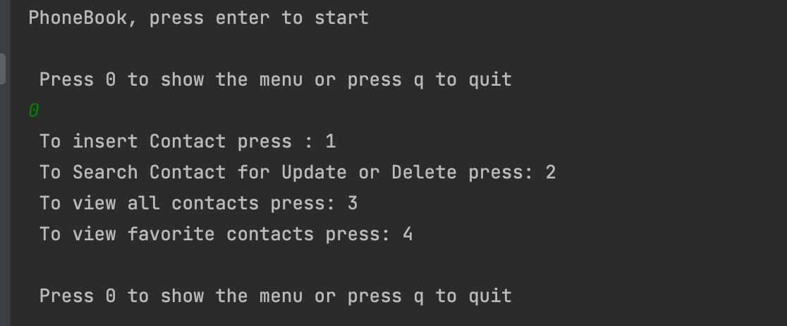

# Phonebook Command Line Application:

* This project was built on Java 17 (LTS) and uses MongoDB through Atlas.
* The excutable JAR file to run the program can be located through the following directories: out-> artifacts->Phonebook_jar->Phonebook.jar.
    
# Summary:
* This program provides an interactive command line Phonebook, which is connected to Atlas cloud servers.
* Multiple Phone Numbers can be assigned to a single contact.
* Contact name or Phone number can't be duplicated across the Phonebook.
* The Phone number should consist of a number and a type, such as (Work,Mobile), and if the user doesn't define a type, it will be set by default as Mobile.
* The type is left for the user's choice when inserting a phone number.
* The program has 2 classes, which are the Contact class and mongoDB class
### The contact class consists of the following attributes :
  * Firstname (String) 
  * Lastname  (String)
  * Numbers   (Hashmap<String,String>)
  * Favorite  (Boolean)
  
### The functions provided for the Phonebook by the mongoDB class :
  * Insert a new contact.
  * Search for an existing Contact.
    * If available, a user can update, delete or mark contact as favorite.
  * Display all the contacts in the phonebook.
  * Display all favorite contacts.
  * Check for duplicate name or number in the phonebook

### Demo for the command line program :

* When you run the program, you will need to press enter to start.
* Following this press 0 to show the menu or press q to Quit.
* After this you can follow the rest of the following procedures according to the required function you want to perform.

